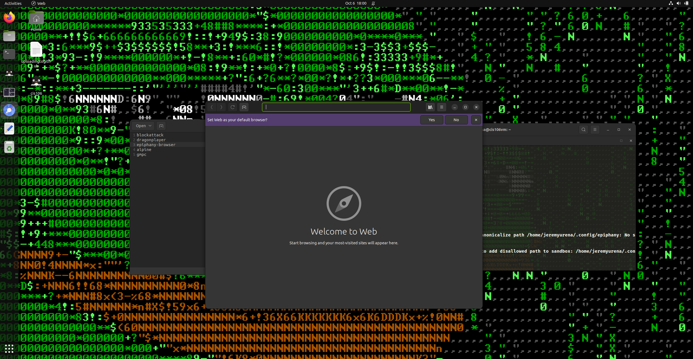

# Lab 3

## Question 1

## Question 2

## Question 3

| Program purpose     | Package Name    | Version            |
| ------------------- | --------------- | ------------------ |
| Play a tetris game  | blockattack     | 2.7.0-1            |
| Play a video file   | dragonplayer    | 4:21.12.3-0ubuntu1 |
| Browse the internet | epiphany-player | 42.4-0ubuntu1      |
| Read your email     | alpine          | 2.25+dfsg1-1build1 |
| Play music          | gmpc            | 11.8.16-19         |

## Question 4
| command | what it does                                                   |
| ------- | -------------------------------------------------------------- |
| echo    | display a line of text                                         |
| fortune | print a random, hopefully interesting, adage                   |
| cowsay  | configurable speaking/thinking cow (and a bit more)            |
| lolcat  | rainbow coloring effect for text console display               |
| figlet  | display large characters made up of ordinary screen characters |
| toilet  | display large colorful characters                             |
| rig     | Random Identity Generator                                      |