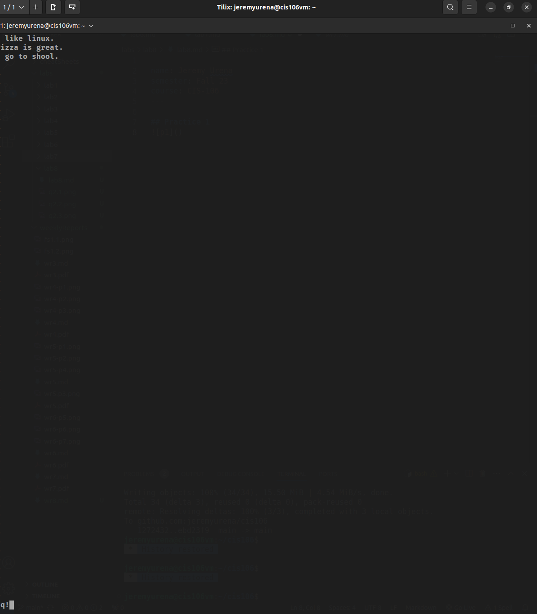
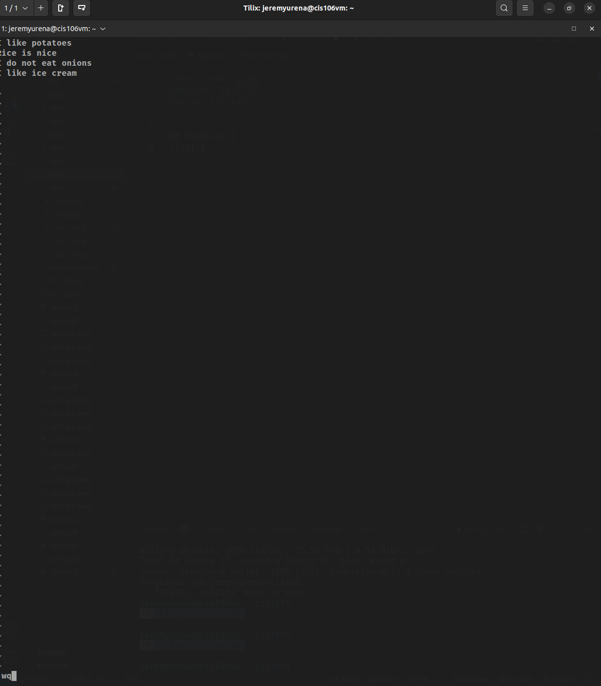
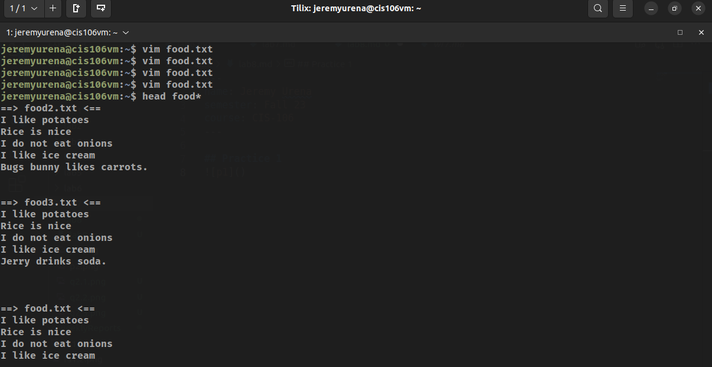
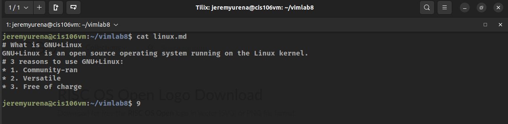
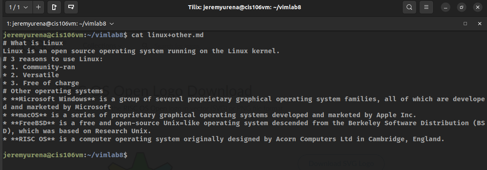
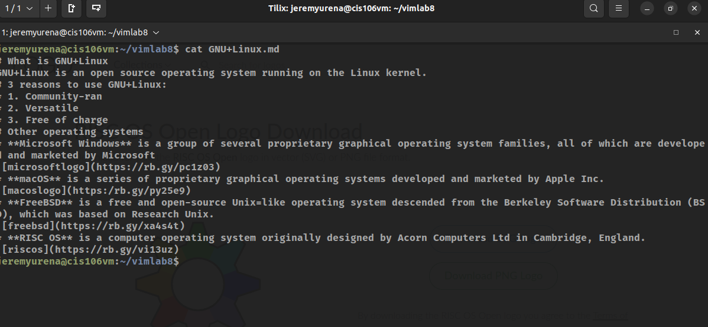

## Practice 1

## Question 2

## URLs
* linux.md: https://github.com/jeremyurena/cis106/blob/main/labs/lab8/linux.md
* linux+other.md: https://github.com/jeremyurena/cis106/blob/main/labs/lab8/linux%2Bother.md
* GNU+Linux.md: https://github.com/jeremyurena/cis106/blob/main/labs/lab8/GNU%2BLinux.md