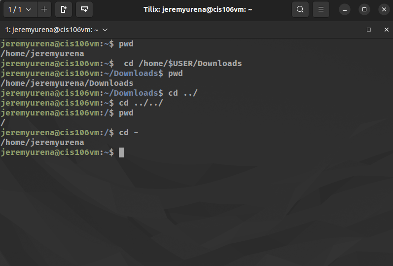
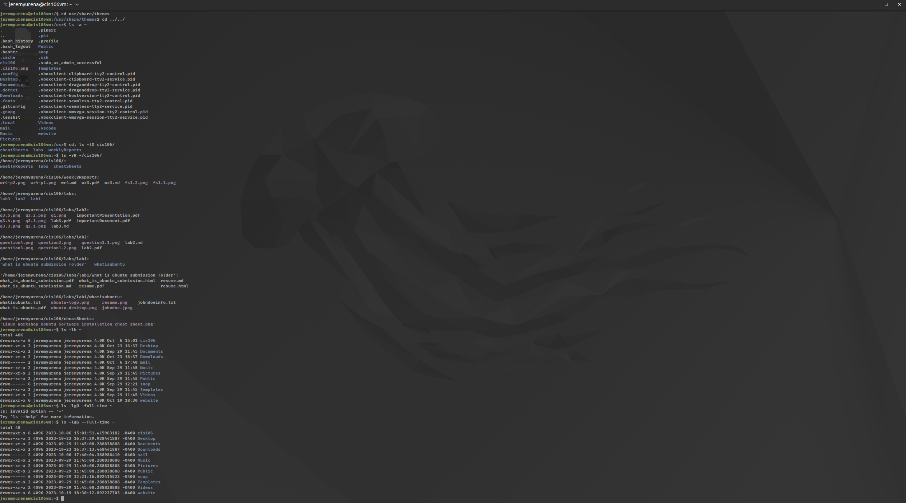
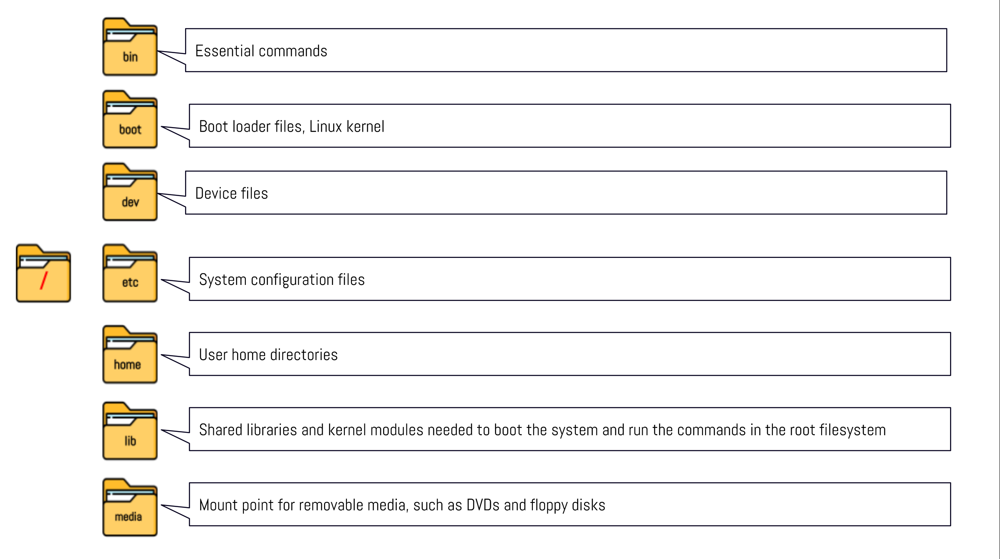
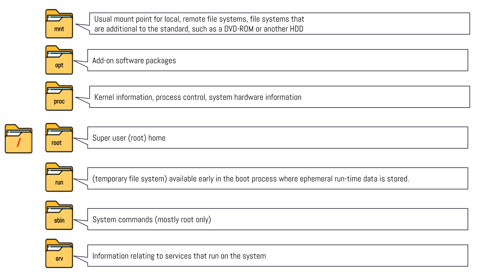

# Week Report 4

## PRACTICE FROM THE PRESENTATION THE LINUX FILE SYSTEM

### Practice 1
  

### Practice 2
  

### Practice 3
  

## THE LINUX FILE SYSTEM DIRECTORIES AND THEIR PURPOSE

  
  

## ALL THE COMMANDS FOR NAVIGATING THE FILESYSTEM

| Commands | What It Does                             | Syntax                          | Example             |
| -------- | ---------------------------------------- | ------------------------------- | ------------------- |
| pwd      | prints current directory                 | pwd                             | `pwd`               |
| cd       | change current working directory         | cd + destination                | `cd ~/Photos`       |
| ls       | display all files inside given directory | ls + option + directory to list | `ls -a ~/Downloads` |

## Basic terminology
* **File system** the way files are stored and organized.
* **Current directory** directory where a user is current at.
* **parent directory** the previous directory from the current directory.
* **the difference between YOUR HOME directory and THE HOME directory** your home directory is the user's home while the home directory is the topmost level of a system drive. 
* **pathname** indicates the location of the file in the filesystem.
* **relative path** the location of a file starting from teh current working directory or a directory that is located inside the current working directory.
* **absolute path** the location of at file starting the root of the file system.