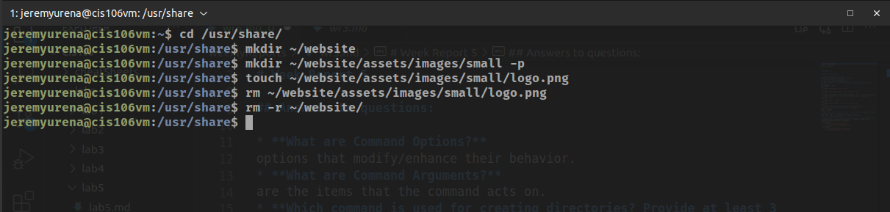

# Week Report 5

## Answers to questions:

* **What are Command Options?**
options that modify/enhance their behavior.
* **What are Command Arguments?**
are the items that the command acts on.
* **Which command is used for creating directories? Provide at least 3 examples.**
the command is mkdir.
* ex. 1:
  * Create a directory: `mkdir pizza`
* ex. 2:
  * Create multi-directories `mkdir hamburger pizza`
* ex. 3:
  * Create a directory inside of a directory: `mkdir pizza pizza/pineapple`
* **What does the touch command do? Provide at least 3 examples.**
it creates files.
* ex. 1:
  * Create file: `touch list`
* ex. 2:
  * Create several files: `touch cars.txt boats.py`
* ex. 3:
  * Create file with spaces in name: `touch hotdog buns.txt`
* **How do you remove a file? Provide an example.**
with rm command
* ex: `rm list`
* **How do you remove a directory and can you remove non-empty directories in Linux? Provide an example**
with rmdir. the rm -r can remove non-empty directories.
* ex: `rm -r Downloads/games`
* **Explain the mv and cp command. Provide at least 2 examples of each**
mv command moves and renames directories. cp command copies files/directories from source to destination
* mv examples:
  * `mv Downloads/image.png Documents`
  * `mv homework.docx dis106homework.docx`
* cp examples:
  * `cp Downloads/wallpapers.zip Pictures/`
  * `cp Downloads/wallpapers ~/Pictures/`

## Practice 1

## Practice 2

## Practice 3

## Practice 4

