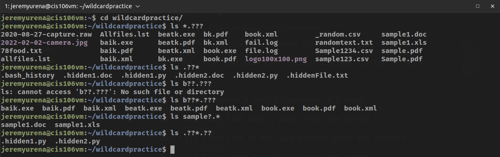

# Week Report 6

## Wildcards

### * Wildcard
The * wildcard matches from anything to nothing with any number of characters.
* Examples:
  * List all the files in a dir. that end in .txt
    * `ls *.txt`
  * List all the files in a dir. that end in .txt and .pdf
    * `ls *.txt *.pdf`
  * List all the files in a dir. that have any letter(s) before or after the string "file."
    * `ls *file.*`

### ? Wildcard
The ? wildcard matches precisely one character
* Examples:
  * List all hidden files in a current dir.
    * `ls ./.??*`
  * List all hidden files in a parent directory.
    * `ls ../.??*`
  * List all files that have two characters between letters b and k
    * `ls b??k*`

### [] Wildcard
The [] wildcard matches a single character in a range.
* Examples:
  * Match all files that have a vowel after the letter f.
    * `ls f[aeiou]*`
  * Match all files that do not have a vowel after the letter f.
    * `ls f[!aeiou]*`
  * Match all files whose name has at least one number.
    * `ls *[0-9]*`

### Brace Expansion
Brace expansion is used for generating arbitrary strings to use with commands.
* Examples:
  * Create an entire dir. structure in a single command.
    * `mkdir -p music/{jazz,rock}/{mp3files,videos,oggfiles}/new{1..3}`
  * Create N number of files.
    * `touch website{1..5}.html`
  * Remove multiple files in a single dir.
    * `rm -r {dir1,dir2,dir3,file.text,file.py}`

## Practice

### Practice 5

### Practice 6

### Practice 7
